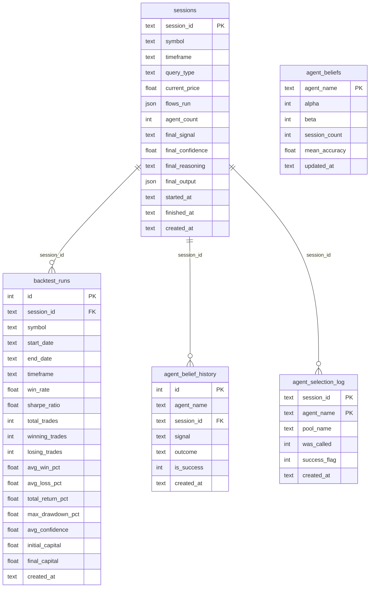

# AstroFin Sentinel V5 — Product Requirements Document v1.0

## 1. Цель и ценность продукта

**Цель:** Мультиагентная торговая система на основе астрофинансовых сигналов, объединяющая фундаментальный, макроэкономический, технический и астрологический анализ для генерации trade recommendations по криптовалютам.

**Ценность:**
- Единая точка входа для принятия trading decisions
- Bayesian belief tracking для continuous learning
- Thompson Sampling для динамического выбора агентов
- Astrology-aware timing через electoral agent

---

## 2. Целевая аудитория и ключевые User Stories

| Persona | Описание |
|---------|---------|
| Retail трейдер | Хочет получить быстрый сигнал без глубокого анализа |
| Algo-трейдер | Интегрирует API в свою систему |
| Инвестор | Использует для долгосрочного позиционирования |

**User Stories:**
- Как трейдер, я хочу получить `BUY`/`SELL` сигнал по BTC/USDT за последние 5 минут
- Как трейдер, я хочу видеть weight каждого агента в финальной рекомендации
- Как инвестор, я хочу фильтровать сигналы по confidence > 0.7
- Как algo-трейдер, я хочу получать JSON output для автоматизации

---

## 3. Стек технологий

| Компонент | Технология | Обоснование |
|-----------|-----------|-------------|
| Orchestration | LangGraph >= 0.0.55 | Belief-Guided conditional graph |
| LLM | OpenAI API | GPT-4 для аналитических агентов |
| Vector DB | FAISS (IndexFlatIP) | Локальная RAG без внешних сервисов |
| Embeddings | nomic-embed-text (Ollama) | Локальные эмбеддинги |
| Ephemeris | Swiss Ephemeris (swisseph) | Точные астрономические данные |
| Math/Stats | NumPy >= 1.26 | Thompson Sampling (Beta sampling) |
| Storage | SQLite | history.db, belief.db, metrics_history.db |
| API | FastAPI / Hono | HTTP endpoints для Sentinel |
| Telegram Bot | python-telegram-bot | Уведомления (опционально) |

---

## 4. Функциональные требования (MoSCoW)

### Must Have
| ID | Требование | Агенты |
|----|-----------|--------|
| F-01 | Генерация торгового сигнала (BUY/SELL/HOLD) | All agents |
| F-02 | Агентный weights-based synthesis | SynthesisAgent |
| F-03 | Thompson Sampling agent selection | ThompsonSampler |
| F-04 | Bayesian belief tracking | BeliefTracker |
| F-05 | Session persistence в SQLite | orchestrator |
| F-06 | ElectoralAgent — астро-тайминг | ElectoralAgent |
| F-07 | Technical analysis flow (MarketAnalyst, Bull/Bear) | Technical flow |
| F-08 | AstroCouncil sub-agents (Gann, Bradley, Elliot, Cycle, TimeWindow) | Astro flow |

### Should Have
| ID | Требование |
|----|-----------|
| F-09 | RAG knowledge retrieval (astrology, technical, trading) |
| F-10 | Backtest metrics tracking |
| F-11 | LangGraph CLI-интерфейс |
| F-12 | Agent selection logging |

### Could Have
| ID | Требование |
|----|-----------|
| F-13 | Telegram notifications |
| F-14 | Visualizations (charts, heatmaps) |
| F-15 | FAISS upgrade с IVFPQ index |

### Won't Have (this release)
| ID | Требование |
|----|-----------|
| F-16 | Real-money integration |
| F-17 | Multi-exchange support (Binance only) |
| F-18 | Portfolio management |

---

## 5. Non-functional требования

| NFR | Target |
|-----|--------|
| **Latency** | Signal generation < 60s (без LLM) |
| **Availability** | 99.5% uptime |
| **Scalability** | До 10 concurrent sessions |
| **Data freshness** | Рыночные данные — last price |
| **History retention** | Sessions: 90 days, Backtest: indefinite |
| **Security** | API keys в environment variables |

---

## 6. Non-goals

- **Не** является financial advisor
- **Не** подключается к live trading accounts
- **Не** поддерживает manual trading
- **Не** включает portfolio optimization
- **Не** использует paid data sources (только free tier)

---

## 7. Структура данных + ER-диаграмма



---

## 8. Архитектура + C4 Component Diagram

```mermaid
C4Container
    title AstroFin Sentinel V5 — Component Architecture

    Container_Boundary(frontend, "Frontend") {
        Component(cli, "CLI", "Python CLI", "Main entry point: python -m cli.main")
        Component(telegram_bot, "Telegram Bot", "python-telegram-bot", "Trade alerts")
    }

    Container_Boundary(api, "API Layer") {
        Component(fastapi, "FastAPI / Hono", "HTTP endpoints", "/api/sentinel, /api/election")
        Component(space_routes, "zo.space Routes", "React pages", "Dashboard UI")
    }

    Container_Boundary(orchestration, "Orchestration") {
        Component(orchestrator, "Orchestrator", "sentinel_v5.py", "Main run loop")
        Component(langgraph, "LangGraph Engine", "langgraph_schema.py", "Belief-Guided Graph")
        Component(synthesis, "SynthesisAgent", "synthesis_agent.py", "Signal synthesis 100%")
    }

    Container_Boundary(agents, "Agents") {
        Component(technical_flow, "Technical Flow", "MarketAnalyst, Bull/Bear Researchers")
        Component(astro_council, "AstroCouncil", "Gann, Bradley, Elliot, Cycle, TimeWindow")
        Component(electoral, "ElectoralAgent", "Muhurta timing")
        Component(macro_flow, "Macro Flow", "Fundamental, Macro, Quant, OptionsFlow, Sentiment")
    }

    Container_Boundary(core, "Core Systems") {
        Component(thompson, "ThompsonSampler", "Agent selection")
        Component(belief, "BeliefTracker", "Bayesian updates")
        Component(rag, "RAG Retriever", "FAISS + Ollama embeddings")
        Component(ephemeris, "Ephemeris Engine", "Swiss Ephemeris")
    }

    Container_Boundary(data, "Data Layer") {
        ComponentDb(history_db, "history.db", "SQLite", "sessions table")
        ComponentDb(belief_db, "belief.db", "SQLite", "agent_beliefs + history")
        ComponentDb(metrics_db, "metrics_history.db", "SQLite", "backtest_runs")
        ComponentDb(faiss_index, "FAISS Indexes", "Vector store", "29 chunks")
    }

    Rel(cli, api, "HTTP POST /run")
    Rel(telegram_bot, api, "HTTP POST /run")
    Rel(space_routes, api, "HTTP GET /status")

    Rel(api, orchestrator, "invoke()")
    Rel(orchestrator, langgraph, "graph.invoke()")
    Rel(langgraph, synthesis, "collects signals")

    Rel(synthesis, thompson, "select agents")
    Rel(thompson, belief, "query beliefs")
    Rel(belief, belief_db, "CRUD")

    Rel(orchestrator, technical_flow, "run_technical()")
    Rel(orchestrator, astro_council, "run_astro_council()")
    Rel(orchestrator, electoral, "run_electoral()")
    Rel(orchestrator, macro_flow, "run_macro()")

    Rel(astro_council, ephemeris, "planetary positions")
    Rel(rag, faiss_index, "vector search")
```

---

## 9. Acceptance Criteria

| AC | Критерий | Метод проверки |
|----|---------|----------------|
| AC-01 | `run_sentinel_v5(symbol="BTCUSDT")` возвращает dict с `final_signal` | `python -m cli.main BTCUSDT` |
| AC-02 | Все агенты записаны в `sessions` table | `SELECT COUNT(*) FROM sessions` |
| AC-03 | Thompson selection логируется в `agent_selection_log` | `SELECT * FROM agent_selection_log` |
| AC-04 | Belief tracker обновляется после каждой сессии | `SELECT * FROM agent_beliefs` |
| AC-05 | LangGraph graph выполняет technical → astro → electoral → synthesis | `python -m cli.main --graph BTCUSDT` |
| AC-06 | RAG retrieval возвращает релевантные chunks | `python knowledge/build_index.py search "nakshatra" --domain astrology` |
| AC-07 | API endpoints отвечают < 200ms | `curl -w "%{time_total}"` |
| AC-08 | Все DB schema на v4 | `python migrations/migrate.py --status` |

---

## 10. Edge cases и обработка ошибок

| Edge Case | Handling |
|-----------|----------|
| LLM API timeout | Graceful degradation — агент возвращает `HOLD` с confidence=0.1 |
| No market data | ElectoralAgent fallback, QuantAgent returns `HOLD` |
| All agents filtered by BeliefGuard | Fallback: run all agents (must have something) |
| Empty belief.db | Uniform prior Beta(1,1) — все агенты равны |
| Duplicate agent implementations | Sub-agents в `_impl/` приоритетнее root-версий |
| DB locked | SQLite WAL mode, retry 3x with exponential backoff |
| Ollama unavailable | RAG falls back to keyword search |
| Swiss Ephemeris error | Return empty aspects list, log warning |

---

## 11. Success Metrics

| Metric | Target | Current |
|--------|--------|---------|
| Win rate (backtest) | > 55% | 12 runs logged |
| Sharpe Ratio | > 1.5 | To be measured |
| Average confidence | > 0.65 | To be measured |
| Agent selection coverage | All 8 astro agents selected >5% | Baseline |
| Session count | > 100 | 0 (pre-launch) |
| API latency (p95) | < 2s | To be measured |
| Graph trace completeness | 100% nodes logged | To be measured |

---

## 12. Риски, допущения и зависимости

### Риски
| Risk | Likelihood | Impact | Mitigation |
|------|------------|--------|------------|
| LLM cost escalation | High | Medium | Cache responses, set spend limits |
| Agent drift (wrong signals) | Medium | High | Bayesian reset after 20 failures |
| Swiss Ephemeris accuracy | Low | High | Validate against known ephemerides |
| DB schema drift | Low | Medium | Migration system in place |

### Допущения
- Binance free tier rate limits не достигнуты
- Ollama embeddings доступны локально
- Пользователь не использует для live trading

### Зависимости
| Dependency | Version | Critical |
|------------|---------|----------|
| langgraph | >= 0.0.55 | Yes |
| numpy | >= 1.26.0 | Yes |
| swisseph | >= 2.10.0 | Yes |
| ollama | running on localhost:11434 | Yes (RAG) |
| OpenAI API | Valid key | Yes |

---

## 13. Definition of Done

### Для фичи (каждый PR)
- [ ] Unit tests (>80% coverage)
- [ ] Schema migration (если DB change)
- [ ] AGENTS.md updated
- [ ] No `raise NotImplementedError`, `TODO`, `STUB`, `FIXME` в production code
- [ ] Backward compatible (если API change)

### Для релиза v1.0
- [ ] Все "Must Have" AC passed
- [ ] 12 backtest runs logged
- [ ] RAG index built (29 chunks)
- [ ] Telegram bot deployable
- [ ] Документация: README + AGENTS.md + PRD
