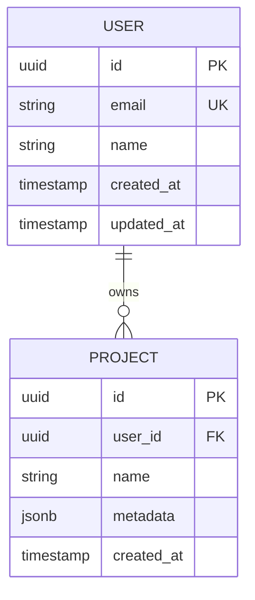

# PRD: [Название проекта]

## 1. Цель и ценность

### Цель
> Что мы создаём и зачем (1–3 предложения)

### Ценность для пользователя
> Какую проблему решает? Какой результат получит пользователь?

### OKR / KPI
| Ключевой результат | Метрика | Целевое значение |
|---|---|---|
| ... | ... | ... |

---

## 2. Целевая аудитория и User Stories

### Primary Persona
| Поле | Описание |
|---|---|
| **Роль** | ... |
| **Возраст/опыт** | ... |
| **Боли** | ... |
| **Цели** | ... |
| **Инструменты** | ... |

### User Stories

| # | Как... | Я хочу... | Чтобы... | Приоритет |
|---|---|---|---|---|
| US-1 | ... | ... | ... | Must |
| US-2 | ... | ... | ... | Should |
| US-3 | ... | ... | ... | Could |

---

## 3. Стек технологий (с обоснованием)

| Компонент | Технология | Почему выбрана | Альтернатива |
|---|---|---|---|
| **Frontend** | ... | ... | ... |
| **Backend** | ... | ... | ... |
| **База данных** | ... | ... | ... |
| **Infrastructure** | ... | ... | ... |
| **AI/ML** | ... | ... | ... |

---

## 4. Функциональные требования (MoSCoW)

### 🟢 Must Have (Критично — релиз невозможен без этого)

| ID | Требование | Описание | Acceptance Criteria |
|---|---|---|---|
| F-01 | ... | ... | ... |
| F-02 | ... | ... | ... |

### 🟡 Should Have (Важно — релиз с этим значительно ценнее)

| ID | Требование | Описание | Acceptance Criteria |
|---|---|---|---|
| F-03 | ... | ... | ... |

### 🔵 Could Have (Желательно — улучшает опыт)

| ID | Требование | Описание | Acceptance Criteria |
|---|---|---|---|
| F-04 | ... | ... | ... |

### ⚪ Won't Have (Отложено / Out of Scope)

| ID | Требование | Почему отложено |
|---|---|---|
| W-01 | ... | ... |

---

## 5. Non-Functional Requirements

| Категория | Требование | Метрика |
|---|---|---|
| **Производительность** | Время ответа API | < 200ms (p95) |
| **Производительность** | RPS | > 100 req/s |
| **Масштабируемость** | Горизонтальное масштабирование | ... |
| **Доступность** | Uptime SLA | 99.9% |
| **Безопасность** | Аутентификация | OAuth 2.0 / JWT |
| **Безопасность** | Шифрование данных | TLS 1.3, at-rest encryption |
| **Безопасность** | Rate limiting | ... |
| **Мониторинг** | Логирование | Structured logs, ELK/Loki |
| **Мониторинг** | Трассировка | OpenTelemetry |
| **Совместимость** | Браузеры | Chrome, Firefox, Safari (latest 2 versions) |
| **Локализация** | Языки | EN, RU (i18n) |

---

## 6. Структура данных и модель БД

### ER-диаграмма (сущности)



### Таблицы / Коллекции

| Таблица | Назначение | Ключевые поля |
|---|---|---|
| `users` | Пользователи | `id`, `email`, `password_hash`, `created_at` |
| `projects` | Проекты | `id`, `user_id`, `name`, `config`, `created_at` |
| `...` | ... | ... |

### Индексы
| Таблица | Индекс | Зачем |
|---|---|---|
| `users` | `email` (UNIQUE) | Быстрый lookup при логине |
| `projects` | `user_id` | Фильтрация по пользователю |

### Миграции
| # | Название | Направление |
|---|---|---|
| 001 | Initial schema | UP |
| 002 | Add projects | UP |

---

## 7. Архитектурные решения + диаграммы

### Component-диаграмма

```mermaid
C4Component
    Container(api_gateway, "API Gateway", "Kong/Nginx", "Маршрутизация запросов")
    Container(app_server, "App Server", "FastAPI/Python", "Бизнес-логика")
    ContainerDb(db, "Database", "PostgreSQL", "Персистентное хранение")
    ContainerCache(cache, "Cache", "Redis", "Кэширование сессий")
    ContainerQueue(queue, "Message Queue", "RabbitMQ", "Асинхронные задачи")

    api_gateway --> app_server
    app_server --> db
    app_server --> cache
    app_server --> queue
```

### Решения по архитектуре

| Решение | Выбор | Обоснование |
|---|---|---|
| **Стиль API** | REST / GraphQL / gRPC | ... |
| **Authentication** | JWT + Refresh tokens | ... |
| **Async processing** | Celery + Redis / Temporal | ... |
| **Deployment** | Docker + K8s / Serverless | ... |
| **CI/CD** | GitHub Actions | ... |

---

## 8. Acceptance Criteria (для каждой фичи)

| Фича | Критерий приёмки | Тест |
|---|---|---|
| F-01: ... | При вводе X → ожидаю Y | e2e / unit тест |
| F-02: ... | ... | ... |

### Definition of Done (общие)
- [ ] Код написан и прошёл code review
- [ ] Unit-тесты покрывают новую логику (> 80%)
- [ ] E2E-тест проходит
- [ ] Документация обновлена
- [ ] Миграция написана и протестирована
- [ ] Метрики / логирование добавлены

---

## 9. Риски и допущения

### Риски

| # | Риск | Вероятность | Влияние | Mitigation |
|---|---|---|---|---|
| R-01 | ... | High/Med/Low | High/Med/Low | ... |
| R-02 | ... | ... | ... | ... |

### Допущения
| # | Допущение |
|---|---|
| A-01 | ... |
| A-02 | ... |

---

## 10. Definition of Done (проекта целиком)

Проект считается завершённым, когда:

- [ ] Все **Must Have** фичи реализованы и приняты
- [ ] Производительность соответствует NFR (< 200ms p95)
- [ ] Security audit пройден (OWASP Top 10)
- [ ] Zero critical bugs в bug tracker
- [ ] Deployment pipeline зелёный
- [ ] Monitoring / alerting настроен
- [ ] Runbook написан
- [ ] Staging-окружение идентично production
- [ ] Заказчик / Stakeholder подписал приёмку

---

## Приложения

### Глоссарий
| Термин | Определение |
|---|---|
| ... | ... |

### Ссылки
- Дизайн: [Figma Link]
- API спецификация: [OpenAPI/Swagger]
- Требования (от заказчика): [Link]
